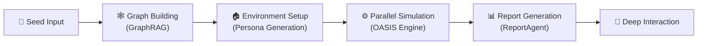

<div align="center">


# MiroFish-Local

**Local-first fork of [MiroFish](https://github.com/666ghj/MiroFish) — with Graphiti + Neo4j for fully local deployment. Your data stays on your machine.**

*A multi-agent swarm intelligence engine that simulates public opinion, market sentiment, and social dynamics. Runs entirely in your local environment.*

[](https://github.com/tt-a1i/MiroFish-local/stargazers)
[](https://github.com/tt-a1i/MiroFish-local/network)
[](https://github.com/tt-a1i/MiroFish-local/blob/main/LICENSE)
[](https://www.docker.com/)

[English](./README-EN.md) | [中文文档](./README.md)

</div>

## 🤔 What is this?

[MiroFish](https://github.com/666ghj/MiroFish) is a multi-agent AI prediction engine that constructs high-fidelity parallel digital worlds for swarm intelligence simulation. However, the original MiroFish relies entirely on **Zep Cloud** for memory and knowledge graph services — data passes through a third-party cloud, and it cannot run in offline environments.

**MiroFish-Local** adds a **Graphiti + Neo4j local mode** on top of the original, allowing you to run the entire simulation pipeline without any cloud-based memory service. The original Zep Cloud mode is fully preserved — switch between modes with a single environment variable.

### How it differs from upstream MiroFish

| Feature | Original MiroFish | MiroFish-Local |
|---------|:-----------------:|:--------------:|
| Memory / Knowledge Graph | Zep Cloud (remote) | **Graphiti + Neo4j (local)** or Zep Cloud |
| Cloud Dependency | Requires Zep Cloud API | **Optional: supports both Cloud and local modes** |
| Data Privacy | Data passes through third-party cloud | **Local mode keeps all data on-premise** |
| Entity Extraction | Built into Zep Cloud | **Local LLM extraction (via Graphiti)** |
| Deployment | Requires Zep Cloud account | **Docker Compose one-click Neo4j startup** |
| Mode Switching | N/A | **`ZEP_BACKEND=cloud\|graphiti`** |

> In short: if you want your **data to stay local**, or need to run MiroFish in an **air-gapped environment**, MiroFish-Local is the version for you.

## 🏗️ Architecture



| Module | Description |
|--------|-------------|
| **Seed Input** | Accepts user-uploaded seed materials (news, reports, novels, etc.) and parses prediction requirements |
| **Graph Building** | Extracts entity relationships via GraphRAG, injects individual and collective memory to build the knowledge graph. Local mode uses Graphiti + Neo4j instead of Zep Cloud |
| **Environment Setup** | Automatically generates agent personas; environment configuration Agent injects simulation parameters |
| **Parallel Simulation** | OASIS engine drives large-scale agent interactions in parallel, dynamically updating temporal memory |
| **Report Generation** | ReportAgent uses a rich toolset to deeply interact with the post-simulation environment and produce prediction reports |
| **Deep Interaction** | Users can chat with any character in the simulated world or discuss further with ReportAgent |

## 🔄 Workflow

1. **Graph Building** — Seed extraction & individual/collective memory injection & GraphRAG construction. The system extracts key entities and relationships from user-uploaded seed materials, building a structured knowledge graph that lays the information foundation for the simulated world.

2. **Environment Setup** — Entity relationship extraction & persona generation & environment configuration Agent injects simulation parameters. Based on the knowledge graph, agents with independent personalities and backstories are automatically generated, and social network topology and initial behavioral parameters are configured.

3. **Simulation** — Dual-platform parallel simulation & automatic prediction requirement parsing & dynamic temporal memory updates. The OASIS engine drives agents to interact freely in the simulated environment, recording behavioral trajectories and attitude shifts in real time.

4. **Report Generation** — ReportAgent with a rich toolset for deep interaction with the post-simulation environment. Simulation data is aggregated and analyzed across multiple dimensions to identify collective behavior patterns, producing structured prediction reports.

5. **Deep Interaction** — Chat with any character in the simulated world & interact with ReportAgent. Users can intervene in the simulated world at any time, exploring how outcomes evolve under different decision paths.

## 🎯 Use Cases

| Scenario | Description |
|----------|-------------|
| 🗞️ **Public Opinion Forecasting & Crisis PR Rehearsal** | Simulate how breaking events propagate through social networks, predict public opinion trajectories, and develop response strategies in advance |
| 💹 **Financial Market Sentiment Analysis** | Build investor behavioral models, simulate market reactions to policies and events, and support investment decisions |
| 🏛️ **Policy Impact Assessment** | Preview policy implementation effects in a virtual society, observing behavioral feedback and social impact across different demographics |
| ✍️ **Creative Experiments** | Novel ending deduction, historical event replay, thought experiments — let your imagination run free in a digital world |
| 🔬 **Social Science Research Simulation** | Provide a large-scale, controllable experimental platform for sociology, communication studies, behavioral economics, and more |

## 🚀 Quick Start

### Prerequisites

> Note: MiroFish was developed and tested on Mac. Windows compatibility is unknown and currently under testing.

| Tool | Version | Description | Check Installation |
|------|---------|-------------|-------------------|
| **Python** | 3.11+ | Backend runtime | `python --version` |
| **Node.js** | 18+ | Frontend runtime, includes npm | `node -v` |
| **uv** | Latest | Python package manager | `uv --version` |
| **Docker** *(optional)* | Latest | Start dependency services (Neo4j) for local mode | `docker --version` |

### 1. Configure Environment Variables

```bash
# Copy the example configuration file
cp .env.example .env

# Edit the .env file and fill in the required API keys
```

Environment variables are organized into the following groups:

#### LLM API Configuration (Required)

Supports any LLM compatible with the OpenAI SDK format. We recommend the Alibaba Bailian Platform's qwen-plus model.

> Note: Simulations can be resource-intensive. Start with fewer than 40 rounds to get a feel for costs.

```env
LLM_API_KEY=your_api_key
LLM_BASE_URL=https://dashscope.aliyuncs.com/compatible-mode/v1
LLM_MODEL_NAME=qwen-plus
```

#### Zep Backend Selection

Use `ZEP_BACKEND` to switch between memory backend modes:

| Value | Mode | Description |
|-------|------|-------------|
| `cloud` | Zep Cloud (default) | Zero configuration, free monthly quota to get started |
| `graphiti` | Local Graphiti + Neo4j | Fully local, data stays on-premise |

```env
ZEP_BACKEND=cloud
```

#### Zep Cloud Configuration (Required when `ZEP_BACKEND=cloud`)

Free registration: https://app.getzep.com/

```env
ZEP_API_KEY=your_zep_api_key
```

#### Graphiti / Neo4j Local Configuration (Required when `ZEP_BACKEND=graphiti`)

```env
NEO4J_URI=bolt://localhost:7687
NEO4J_USER=neo4j
NEO4J_PASSWORD=password

# LLM models used by Graphiti (explicit configuration recommended)
GRAPHITI_LLM_MODEL=qwen3-max
GRAPHITI_EMBEDDING_MODEL=text-embedding-v4
```

> `OPENAI_API_KEY` / `OPENAI_BASE_URL` are automatically mapped from `LLM_API_KEY` / `LLM_BASE_URL` — no need to configure them separately. To specify a different LLM for Graphiti, explicitly set `OPENAI_API_KEY` and `OPENAI_BASE_URL`.

#### Boost LLM Configuration (Optional)

Configure a separate LLM to accelerate specific pipeline stages:

```env
LLM_BOOST_API_KEY=your_boost_api_key
LLM_BOOST_BASE_URL=https://another-api-provider.com/v1
LLM_BOOST_MODEL_NAME=gpt-4o-mini
```

### 2. Start Dependency Services (Optional, Local Mode Only)

If you chose `ZEP_BACKEND=graphiti`, start the Neo4j database first:

```bash
# Start dependency services (Neo4j 5.26 + APOC plugin) via Docker Compose
docker-compose -f docker-compose.local.yml up -d

# Check service status
docker-compose -f docker-compose.local.yml ps

# Neo4j Browser available at http://localhost:7474 (user: neo4j, password: password)
```

### 3. Install Dependencies

```bash
# One-click installation of all dependencies (root + frontend + backend)
npm run setup:all
```

Or install step by step:

```bash
# Install Node dependencies (root + frontend)
npm run setup

# Install Python dependencies (auto-creates virtual environment)
npm run setup:backend
```

### 4. Start Services

```bash
# Start both frontend and backend (run from project root)
npm run dev
```

**Service URLs:**
- Frontend: `http://localhost:3000`
- Backend API: `http://localhost:5001`

**Start Individually:**

```bash
npm run backend   # Start backend only
npm run frontend  # Start frontend only
```

## 💻 Hardware Requirements

MiroFish is an LLM-calling application — the heavy computation is handled by remote LLM APIs, so local resource requirements are modest.

| Tier | CPU | RAM | Disk | GPU |
|------|-----|-----|------|-----|
| **Minimum** | 4 cores | 8 GB | 10 GB | Not required |
| **Recommended** | 8 cores | 16 GB | 20 GB | Not required |

> Note: A GPU is only needed if you deploy an LLM locally (e.g., running a local model with Ollama). No GPU is required when using cloud LLM APIs.

## ❓ FAQ

<details>
<summary><b>What's the difference between Cloud and Local mode?</b></summary>

Cloud mode uses Zep Cloud for memory and knowledge graph storage — easy to set up but data passes through a third-party cloud. Local mode uses Graphiti + Neo4j, keeping all data on-premise. Ideal for privacy-sensitive or air-gapped environments. Switch with the `ZEP_BACKEND` environment variable.
</details>

<details>
<summary><b>Neo4j won't start — what do I do?</b></summary>

1. Confirm Docker is installed and running: `docker --version`
2. Check if ports 7474/7687 are in use: `lsof -i :7474`
3. Check container logs: `docker-compose -f docker-compose.local.yml logs neo4j`
4. Try a clean restart: `docker-compose -f docker-compose.local.yml down -v && docker-compose -f docker-compose.local.yml up -d`
</details>

<details>
<summary><b>Which LLMs are supported?</b></summary>

Any LLM API compatible with the OpenAI SDK format, including: Alibaba Bailian (qwen-plus/qwen-max), OpenAI (GPT-4o), DeepSeek, local Ollama, and more. Just configure `LLM_BASE_URL` and `LLM_API_KEY`.
</details>

<details>
<summary><b>How many tokens does a simulation cost?</b></summary>

It depends on the number of agents and simulation rounds. For your first run, we recommend fewer than 40 rounds, which typically consumes ~500K–1M tokens.
</details>

## 🤝 Contributing

We welcome Pull Requests and Issues! See [CONTRIBUTING.md](./CONTRIBUTING.md) for details.

## 📄 Credits & Attribution

**This project is a modified fork of [MiroFish](https://github.com/666ghj/MiroFish).**

Thanks to the original project [666ghj/MiroFish](https://github.com/666ghj/MiroFish) and Shanda Group for their open-source contributions. MiroFish's core simulation engine is powered by **[OASIS](https://github.com/camel-ai/oasis)**, a high-performance social media simulation framework developed by the [CAMEL-AI](https://github.com/camel-ai) team, supporting million-scale agent interaction simulations.

**Key changes in this fork:**
- Added Graphiti + Neo4j local memory backend, replacing Zep Cloud dependency
- Implemented `ZEP_BACKEND` environment variable for `cloud` / `graphiti` dual-mode switching
- Added Docker Compose configuration for one-click Neo4j 5.26 + APOC plugin startup
- Auto-mapping of LLM configuration to Graphiti, reducing redundant configuration
- Added search re-ranking fallback (non-standard APIs auto-switch to RRF re-ranking)

## 📈 Project Statistics

<a href="https://www.star-history.com/#tt-a1i/MiroFish-local&type=date&legend=top-left">
 <picture>
   <source media="(prefers-color-scheme: dark)" srcset="https://api.star-history.com/svg?repos=tt-a1i/MiroFish-local&type=date&theme=dark&legend=top-left" />
   <source media="(prefers-color-scheme: light)" srcset="https://api.star-history.com/svg?repos=tt-a1i/MiroFish-local&type=date&legend=top-left" />
   
 </picture>
</a>
