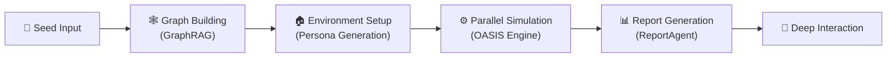

<div align="center">


简洁通用的群体智能引擎，预测万物
</br>
<em>A Simple and Universal Swarm Intelligence Engine, Predicting Anything</em>

<a href="https://www.shanda.com/" target="_blank"></a>

[](https://github.com/tt-a1i/MiroFish-local/stargazers)
[](https://github.com/tt-a1i/MiroFish-local/watchers)
[](https://github.com/tt-a1i/MiroFish-local/network)
[](https://github.com/tt-a1i/MiroFish-local/issues)
[](https://github.com/tt-a1i/MiroFish-local/pulls)

[](https://github.com/tt-a1i/MiroFish-local/blob/main/LICENSE)
[](https://deepwiki.com/tt-a1i/MiroFish-local)
[](https://github.com/tt-a1i/MiroFish-local)
[](https://www.python.org/)
[](https://nodejs.org/)
[](https://www.docker.com/)

[English](./README-EN.md) | [中文文档](./README.md)

</div>

## ⚡ Overview

**MiroFish** is a next-generation AI prediction engine powered by multi-agent technology. By extracting seed information from the real world (such as breaking news, policy drafts, or financial signals), it automatically constructs a high-fidelity parallel digital world. Within this space, thousands of intelligent agents with independent personalities, long-term memory, and behavioral logic freely interact and undergo social evolution. You can inject variables dynamically from a "God's-eye view" to precisely deduce future trajectories — **rehearse the future in a digital sandbox, and win decisions after countless simulations**.

> You only need to: Upload seed materials (data analysis reports or interesting novel stories) and describe your prediction requirements in natural language</br>
> MiroFish will return: A detailed prediction report and a deeply interactive high-fidelity digital world

### Our Vision

MiroFish is dedicated to creating a swarm intelligence mirror that maps reality. By capturing the collective emergence triggered by individual interactions, we break through the limitations of traditional prediction:

- **At the Macro Level**: We are a rehearsal laboratory for decision-makers, allowing policies and public relations to be tested at zero risk
- **At the Micro Level**: We are a creative sandbox for individual users — whether deducing novel endings or exploring imaginative scenarios, everything can be fun, playful, and accessible

From serious predictions to playful simulations, we let every "what if" see its outcome, making it possible to predict anything.

### Key Highlights

- 🧠 **Multi-Agent Swarm Intelligence Simulation** — Thousands of agents with independent personalities interact freely, producing emergent social dynamics
- 🌐 **High-Fidelity Parallel World Construction** — Automatically extracts entity relationships via GraphRAG to build simulation environments in one click
- 📊 **Automated Prediction Report Generation** — ReportAgent performs deep analysis of simulation results and outputs structured prediction reports
- 💬 **Deep Interaction with the Simulated World** — Chat with any character in the simulation to explore parallel possibilities
- 🔧 **Cloud / Local Dual-Mode Deployment** — Quick start with Zep Cloud, or go fully local with Graphiti + Neo4j

## 🎬 Demo Videos

<div align="center">
<a href="https://www.bilibili.com/video/BV1VYBsBHEMY/" target="_blank"></a>

Click the image to watch the complete demo video for prediction using BettaFish-generated "Wuhan University Public Opinion Report"
</div>

> More demo videos coming soon: "Dream of the Red Chamber" ending simulation, financial prediction examples...

## 🖼️ UI Screenshots

<div align="center">
<!-- UI screenshots coming soon -->
<p><em>🖼️ UI screenshots coming soon...</em></p>
</div>

## 🏗️ Architecture



| Module | Description |
|--------|-------------|
| **Seed Input** | Accepts user-uploaded seed materials (news, reports, novels, etc.) and parses prediction requirements |
| **Graph Building** | Extracts entity relationships via GraphRAG, injects individual and collective memory to build the knowledge graph |
| **Environment Setup** | Automatically generates agent personas; environment configuration Agent injects simulation parameters |
| **Parallel Simulation** | OASIS engine drives large-scale agent interactions in parallel, dynamically updating temporal memory |
| **Report Generation** | ReportAgent uses a rich toolset to deeply interact with the post-simulation environment and produce prediction reports |
| **Deep Interaction** | Users can chat with any character in the simulated world or discuss further with ReportAgent |

## 🔄 Workflow

1. **Graph Building** — Seed extraction & individual/collective memory injection & GraphRAG construction. The system extracts key entities and relationships from user-uploaded seed materials, building a structured knowledge graph that lays the information foundation for the simulated world.

2. **Environment Setup** — Entity relationship extraction & persona generation & environment configuration Agent injects simulation parameters. Based on the knowledge graph, agents with independent personalities and backstories are automatically generated, and social network topology and initial behavioral parameters are configured.

3. **Simulation** — Dual-platform parallel simulation & automatic prediction requirement parsing & dynamic temporal memory updates. The OASIS engine drives agents to interact freely in the simulated environment, recording behavioral trajectories and attitude shifts in real time.

4. **Report Generation** — ReportAgent with a rich toolset for deep interaction with the post-simulation environment. Simulation data is aggregated and analyzed across multiple dimensions to identify collective behavior patterns, producing structured prediction reports.

5. **Deep Interaction** — Chat with any character in the simulated world & interact with ReportAgent. Users can intervene in the simulated world at any time, exploring how outcomes evolve under different decision paths.

## 🎯 Use Cases

| Scenario | Description |
|----------|-------------|
| 🗞️ **Public Opinion Forecasting & Crisis PR Rehearsal** | Simulate how breaking events propagate through social networks, predict public opinion trajectories, and develop response strategies in advance |
| 💹 **Financial Market Sentiment Analysis** | Build investor behavioral models, simulate market reactions to policies and events, and support investment decisions |
| 🏛️ **Policy Impact Assessment** | Preview policy implementation effects in a virtual society, observing behavioral feedback and social impact across different demographics |
| ✍️ **Creative Experiments** | Novel ending deduction, historical event replay, thought experiments — let your imagination run free in a digital world |
| 🔬 **Social Science Research Simulation** | Provide a large-scale, controllable experimental platform for sociology, communication studies, behavioral economics, and more |

## 🚀 Quick Start

### Prerequisites

> Note: MiroFish was developed and tested on Mac. Windows compatibility is unknown and currently under testing.

| Tool | Version | Description | Check Installation |
|------|---------|-------------|-------------------|
| **Python** | 3.11+ | Backend runtime | `python --version` |
| **Node.js** | 18+ | Frontend runtime, includes npm | `node -v` |
| **uv** | Latest | Python package manager | `uv --version` |
| **Docker** *(optional)* | Latest | Start dependency services (Neo4j) for local mode | `docker --version` |

### 1. Configure Environment Variables

```bash
# Copy the example configuration file
cp .env.example .env

# Edit the .env file and fill in the required API keys
```

Environment variables are organized into the following groups:

#### LLM API Configuration (Required)

Supports any LLM compatible with the OpenAI SDK format. We recommend the Alibaba Bailian Platform's qwen-plus model.

> Note: Simulations can be resource-intensive. Start with fewer than 40 rounds to get a feel for costs.

```env
LLM_API_KEY=your_api_key
LLM_BASE_URL=https://dashscope.aliyuncs.com/compatible-mode/v1
LLM_MODEL_NAME=qwen-plus
```

#### Zep Backend Selection

Use `ZEP_BACKEND` to switch between memory backend modes:

| Value | Mode | Description |
|-------|------|-------------|
| `cloud` | Zep Cloud (default) | Zero configuration, free monthly quota to get started |
| `graphiti` | Local Graphiti + Neo4j | Fully local, data stays on-premise |

```env
ZEP_BACKEND=cloud
```

#### Zep Cloud Configuration (Required when `ZEP_BACKEND=cloud`)

Free registration: https://app.getzep.com/

```env
ZEP_API_KEY=your_zep_api_key
```

#### Graphiti / Neo4j Local Configuration (Required when `ZEP_BACKEND=graphiti`)

```env
NEO4J_URI=bolt://localhost:7687
NEO4J_USER=neo4j
NEO4J_PASSWORD=password

# LLM models used by Graphiti (explicit configuration recommended)
GRAPHITI_LLM_MODEL=qwen3-max
GRAPHITI_EMBEDDING_MODEL=text-embedding-v4
```

> `OPENAI_API_KEY` / `OPENAI_BASE_URL` are automatically mapped from `LLM_API_KEY` / `LLM_BASE_URL` — no need to configure them separately. To specify a different LLM for Graphiti, explicitly set `OPENAI_API_KEY` and `OPENAI_BASE_URL`.

#### Boost LLM Configuration (Optional)

Configure a separate LLM to accelerate specific pipeline stages:

```env
LLM_BOOST_API_KEY=your_boost_api_key
LLM_BOOST_BASE_URL=https://another-api-provider.com/v1
LLM_BOOST_MODEL_NAME=gpt-4o-mini
```

### 2. Start Dependency Services (Optional, Local Mode Only)

If you chose `ZEP_BACKEND=graphiti`, start the Neo4j database first:

```bash
# Start dependency services (Neo4j) via Docker Compose
docker-compose -f docker-compose.local.yml up -d
```

### 3. Install Dependencies

```bash
# One-click installation of all dependencies (root + frontend + backend)
npm run setup:all
```

Or install step by step:

```bash
# Install Node dependencies (root + frontend)
npm run setup

# Install Python dependencies (auto-creates virtual environment)
npm run setup:backend
```

### 4. Start Services

```bash
# Start both frontend and backend (run from project root)
npm run dev
```

**Service URLs:**
- Frontend: `http://localhost:3000`
- Backend API: `http://localhost:5001`

**Start Individually:**

```bash
npm run backend   # Start backend only
npm run frontend  # Start frontend only
```

## 💻 Hardware Requirements

MiroFish is an LLM-calling application — the heavy computation is handled by remote LLM APIs, so local resource requirements are modest.

| Tier | CPU | RAM | Disk | GPU |
|------|-----|-----|------|-----|
| **Minimum** | 4 cores | 8 GB | 10 GB | Not required |
| **Recommended** | 8 cores | 16 GB | 20 GB | Not required |

> Note: A GPU is only needed if you deploy an LLM locally (e.g., running a local model with Ollama). No GPU is required when using cloud LLM APIs.

## 🤝 Contributing

We welcome Pull Requests and Issues! Whether it's bug reports, feature suggestions, or documentation improvements, we truly appreciate every contribution from the community.

> Contributing guidelines are being finalized — stay tuned.

## 📄 Acknowledgments

**MiroFish has received strategic support and incubation from Shanda Group!**

MiroFish's core simulation engine is powered by **[OASIS](https://github.com/camel-ai/oasis)**. OASIS is a high-performance social media simulation framework developed by the [CAMEL-AI](https://github.com/camel-ai) team, supporting million-scale agent interaction simulations and providing a solid technical foundation for MiroFish's swarm intelligence emergence. We sincerely thank the CAMEL-AI team for their open-source contributions!

## 📈 Project Statistics

<a href="https://www.star-history.com/#tt-a1i/MiroFish-local&type=date&legend=top-left">
 <picture>
   <source media="(prefers-color-scheme: dark)" srcset="https://api.star-history.com/svg?repos=tt-a1i/MiroFish-local&type=date&theme=dark&legend=top-left" />
   <source media="(prefers-color-scheme: light)" srcset="https://api.star-history.com/svg?repos=tt-a1i/MiroFish-local&type=date&legend=top-left" />
   
 </picture>
</a>
