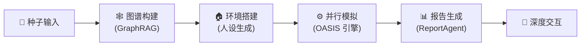

<div align="center">


# MiroFish-Local

**基于 [MiroFish](https://github.com/666ghj/MiroFish) 的本地化增强版 — 支持 Graphiti + Neo4j 完全本地部署，数据不出域。**

*多智能体群体智能仿真引擎，模拟舆情、市场情绪与社会动态。可完全运行在本地环境。*

[](https://github.com/tt-a1i/MiroFish-local/stargazers)
[](https://github.com/tt-a1i/MiroFish-local/network)
[](https://github.com/tt-a1i/MiroFish-local/blob/main/LICENSE)
[](https://www.docker.com/)
[](https://github.com/tt-a1i/MiroFish-local/actions/workflows/ci.yml)

[English](./README-EN.md) | [中文文档](./README.md)

</div>

## 🤔 这是什么？

[MiroFish](https://github.com/666ghj/MiroFish) 是一款基于多智能体技术的 AI 预测引擎，通过构建高保真平行数字世界进行群体智能仿真。但原版 MiroFish 的记忆与知识图谱完全依赖 **Zep Cloud** 云服务——数据经过云端，且无法在离线环境运行。

**MiroFish-Local** 在原版基础上新增了 **Graphiti + Neo4j 本地模式**，让你可以在完全不依赖云端记忆服务的情况下运行整个仿真流程。同时保留了原版的 Zep Cloud 模式，通过一个环境变量即可自由切换。

### 与原版 MiroFish 的差异

| 特性 | 原版 MiroFish | MiroFish-Local |
|------|:------------:|:--------------:|
| 记忆 / 知识图谱 | Zep Cloud（云端） | **Graphiti + Neo4j（本地）** 或 Zep Cloud |
| 云端依赖 | 必须使用 Zep Cloud API | **可选：支持 Cloud 和本地双模式** |
| 数据隐私 | 数据经过第三方云端 | **本地模式下数据完全不出域** |
| 实体抽取 | Zep Cloud 内置 | **本地 LLM 同步抽取（via Graphiti）** |
| 部署依赖 | 需要 Zep Cloud 账号 | **Docker Compose 一键启动 Neo4j** |
| 模式切换 | 无 | **`ZEP_BACKEND=cloud\|graphiti` 一键切换** |

> 一句话总结：如果你希望**数据完全留在本地**，或者在**无外网环境**下运行 MiroFish，MiroFish-Local 就是你需要的版本。

## 🏗️ 系统架构



| 模块 | 说明 |
|------|------|
| **种子输入** | 接收用户上传的种子材料（新闻、报告、小说等），解析预测需求 |
| **图谱构建** | 基于 GraphRAG 提取实体关系，注入个体与群体记忆，构建知识图谱。本地模式使用 Graphiti + Neo4j 替代 Zep Cloud |
| **环境搭建** | 自动生成智能体人设，由环境配置 Agent 注入仿真参数 |
| **并行模拟** | OASIS 引擎驱动大规模智能体并行交互，动态更新时序记忆 |
| **报告生成** | ReportAgent 使用丰富工具集与模拟后环境深度交互，生成预测报告 |
| **深度交互** | 用户可与模拟世界中的任意角色对话，或与 ReportAgent 进一步探讨 |

## 🔄 工作流程

1. **图谱构建** — 现实种子提取 & 个体与群体记忆注入 & GraphRAG 构建。系统从用户上传的种子材料中抽取关键实体与关系，构建结构化知识图谱，为仿真世界奠定信息基础。

2. **环境搭建** — 实体关系抽取 & 人设生成 & 环境配置 Agent 注入仿真参数。基于图谱自动生成具有独立人格和背景故事的智能体，配置社交网络拓扑与初始行为参数。

3. **开始模拟** — 双平台并行模拟 & 自动解析预测需求 & 动态更新时序记忆。OASIS 引擎驱动智能体在仿真环境中自由交互，实时记录行为轨迹与态度变化。

4. **报告生成** — ReportAgent 拥有丰富的工具集与模拟后环境进行深度交互。汇聚仿真数据，从多维度分析群体行为模式，输出结构化预测报告。

5. **深度互动** — 与模拟世界中的任意角色进行对话 & 与 ReportAgent 进行对话。用户可随时介入仿真世界，探索不同决策路径下的演化结果。

## 🎯 应用场景

| 场景 | 描述 |
|------|------|
| 🗞️ **舆情预测与危机公关预演** | 模拟突发事件在社交网络中的传播路径，预判舆论走向，提前制定应对方案 |
| 💹 **金融市场情绪推演** | 构建投资者群体行为模型，模拟市场对政策、事件的反应，辅助投资决策 |
| 🏛️ **政策影响评估** | 在虚拟社会中预演政策实施效果，观察不同群体的行为反馈与社会影响 |
| ✍️ **创意实验** | 小说结局推演、历史事件重演、脑洞验证——让想象力在数字世界中自由奔跑 |
| 🔬 **社会科学研究模拟** | 为社会学、传播学、行为经济学等学科提供大规模可控实验平台 |

## 🚀 快速开始

### 前置要求

> 注：MiroFish 在 Mac 环境下完成开发与测试，Windows 兼容性未知，测试中

| 工具 | 版本要求 | 说明 | 安装检查 |
|------|---------|------|---------|
| **Python** | 3.11+ | 后端运行环境 | `python --version` |
| **Node.js** | 18+ | 前端运行环境，包含 npm | `node -v` |
| **uv** | 最新版 | Python 包管理器 | `uv --version` |
| **Docker** *(可选)* | 最新版 | 本地模式启动 Neo4j 等依赖服务 | `docker --version` |

### 1. 配置环境变量

```bash
# 复制示例配置文件
cp .env.example .env

# 编辑 .env 文件，填入必要的 API 密钥
```

环境变量分为以下几组：

#### LLM API 配置（必需）

支持 OpenAI SDK 格式的任意 LLM。推荐使用阿里百炼平台 qwen-plus 模型。

> 注意：模拟消耗较大，建议先进行小于 40 轮的模拟尝试。

```env
LLM_API_KEY=your_api_key
LLM_BASE_URL=https://dashscope.aliyuncs.com/compatible-mode/v1
LLM_MODEL_NAME=qwen-plus
```

#### Zep 后端选择

通过 `ZEP_BACKEND` 切换记忆后端模式：

| 值 | 模式 | 说明 |
|---|------|------|
| `cloud` | Zep Cloud（默认） | 零配置，每月免费额度即可上手 |
| `graphiti` | 本地 Graphiti + Neo4j | 完全本地化，数据不出域 |

```env
ZEP_BACKEND=cloud
```

#### Zep Cloud 配置（`ZEP_BACKEND=cloud` 时必需）

免费注册：https://app.getzep.com/

```env
ZEP_API_KEY=your_zep_api_key
```

#### Graphiti / Neo4j 本地配置（`ZEP_BACKEND=graphiti` 时必需）

```env
NEO4J_URI=bolt://localhost:7687
NEO4J_USER=neo4j
NEO4J_PASSWORD=password

# Graphiti 使用的 LLM 模型（推荐显式配置）
GRAPHITI_LLM_MODEL=qwen3-max
GRAPHITI_EMBEDDING_MODEL=text-embedding-v4
```

> `OPENAI_API_KEY` / `OPENAI_BASE_URL` 会自动从 `LLM_API_KEY` / `LLM_BASE_URL` 映射，无需重复配置。如需单独指定 Graphiti 使用的 LLM，可显式设置 `OPENAI_API_KEY` 和 `OPENAI_BASE_URL`。

#### 加速 LLM 配置（可选）

可配置独立的加速 LLM 用于提升特定环节的处理速度：

```env
LLM_BOOST_API_KEY=your_boost_api_key
LLM_BOOST_BASE_URL=https://another-api-provider.com/v1
LLM_BOOST_MODEL_NAME=gpt-4o-mini
```

### 2. 启动依赖服务（可选，仅本地模式）

如果选择 `ZEP_BACKEND=graphiti`，需要先启动 Neo4j 数据库：

```bash
# 使用 Docker Compose 启动依赖服务（Neo4j 5.26 + APOC 插件）
docker-compose -f docker-compose.local.yml up -d

# 检查服务状态
docker-compose -f docker-compose.local.yml ps

# Neo4j Browser 可通过 http://localhost:7474 访问（用户名: neo4j, 密码: password）
```

### 3. 安装依赖

```bash
# 一键安装所有依赖（根目录 + 前端 + 后端）
npm run setup:all
```

或者分步安装：

```bash
# 安装 Node 依赖（根目录 + 前端）
npm run setup

# 安装 Python 依赖（自动创建虚拟环境）
npm run setup:backend
```

### 4. 启动服务

```bash
# 同时启动前后端（在项目根目录执行）
npm run dev
```

**服务地址：**
- 前端：`http://localhost:3000`
- 后端 API：`http://localhost:5001`

**单独启动：**

```bash
npm run backend   # 仅启动后端
npm run frontend  # 仅启动前端
```

## 💻 硬件需求

MiroFish 本身是 LLM 调用型应用，计算主要依赖远端 LLM API，本地资源需求较低。

| 配置 | CPU | 内存 | 磁盘 | GPU |
|------|-----|------|------|-----|
| **最低配置** | 4 核 | 8 GB | 10 GB | 不需要 |
| **推荐配置** | 8 核 | 16 GB | 20 GB | 不需要 |

> 说明：GPU 仅在本地部署 LLM（如使用 Ollama 等工具运行本地模型）时需要。使用云端 LLM API 无需 GPU。

## ❓ FAQ

<details>
<summary><b>Cloud 模式和本地模式有什么区别？</b></summary>

Cloud 模式使用 Zep Cloud 云服务存储记忆和知识图谱，配置简单但数据经过云端。本地模式使用 Graphiti + Neo4j，数据完全留在本地，适合对数据隐私有要求或无外网的环境。通过 `ZEP_BACKEND` 环境变量一键切换。
</details>

<details>
<summary><b>Neo4j 启动失败怎么办？</b></summary>

1. 确认 Docker 已安装并运行：`docker --version`
2. 检查端口 7474/7687 是否被占用：`lsof -i :7474`
3. 查看容器日志：`docker-compose -f docker-compose.local.yml logs neo4j`
4. 尝试清理重启：`docker-compose -f docker-compose.local.yml down -v && docker-compose -f docker-compose.local.yml up -d`
</details>

<details>
<summary><b>支持哪些 LLM？</b></summary>

支持任何兼容 OpenAI SDK 格式的 LLM API，包括：阿里百炼（qwen-plus/qwen-max）、OpenAI（GPT-4o）、DeepSeek、本地 Ollama 等。只需配置 `LLM_BASE_URL` 和 `LLM_API_KEY` 即可。
</details>

<details>
<summary><b>模拟一次大概消耗多少 Token？</b></summary>

取决于智能体数量和模拟轮次。建议首次体验使用少于 40 轮的模拟，消耗约 50-100 万 Token。
</details>

## 🤝 贡献指南

欢迎提交 Pull Request 和 Issue！详见 [CONTRIBUTING.md](./CONTRIBUTING.md)。

## 📄 致谢与归属

**本项目是 [MiroFish](https://github.com/666ghj/MiroFish) 的修改版 fork。**

感谢原项目 [666ghj/MiroFish](https://github.com/666ghj/MiroFish) 及盛大集团的开源贡献。MiroFish 的核心仿真引擎由 **[OASIS](https://github.com/camel-ai/oasis)** 驱动，OASIS 是由 [CAMEL-AI](https://github.com/camel-ai) 团队开发的高性能社交媒体模拟框架，支持百万级智能体交互仿真。

**本 fork 的主要修改：**
- 新增 Graphiti + Neo4j 本地记忆后端，替代 Zep Cloud 云端依赖
- 实现 `ZEP_BACKEND` 环境变量，支持 `cloud` / `graphiti` 双模式切换
- 添加 Docker Compose 配置，一键启动 Neo4j 5.26 + APOC 插件
- 自动映射 LLM 配置到 Graphiti，减少重复配置
- 新增搜索重排序降级机制（非标准 API 自动切换 RRF 重排序）

## 📈 项目统计

<a href="https://www.star-history.com/#tt-a1i/MiroFish-local&type=date&legend=top-left">
 <picture>
   <source media="(prefers-color-scheme: dark)" srcset="https://api.star-history.com/svg?repos=tt-a1i/MiroFish-local&type=date&theme=dark&legend=top-left" />
   <source media="(prefers-color-scheme: light)" srcset="https://api.star-history.com/svg?repos=tt-a1i/MiroFish-local&type=date&legend=top-left" />
   
 </picture>
</a>
